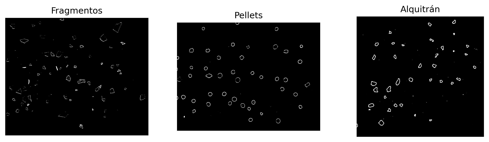
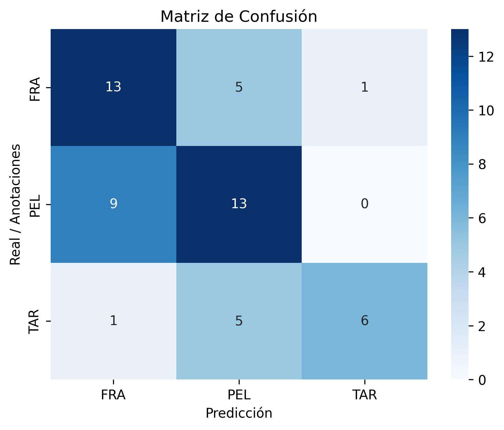

# VC_P3

Práctica realizada por el grupo 15 (Lucía Motas Guedes y Raúl Marrero Marichal)

# Tarea reconocimiento de monedas

Para esta primera tarea, se realiza el reconocimiento de monedas de euros y céntimos de varias imágenes. Para ello, se hace uso de los métodos mostrados en la propia práctica, basando el reconocimiento en el tamaño de las monedas.

## Caso de ejemplo y calibración
Para el primer caso de ejemplo con imagen ideal _[Monedas.jpg](./Test/Monedas.jpg)_ proporcionada para la práctica, se comienza convirtiendo la imagen original a escala de grises, con su posterior umbralizado invertido (dado el fondo blanco de la imagen) con un umbral establecido de manera manual, siendo 200 en este caso.

Dado que las imágenes de las monedas pueden estar rotadas en posteriores imágenes o presentar leves deformaciones, se opta por hacer una búsqueda de los contornos externos con la función `cv2.cvtColor`, en lugar de la alternativa de la Transformada de Hough propuesta por la práctica.

Tras la detección de contornos, se recorre el array de resultados, filtrando posibles artefactos detectados. Usando la función `cv2.minEnclosingCircle`, se obtienen el mínimo círculo que contiene al contorno, extrayendo los radios de las monedas que se ordenan de mayor a menor y se les asigna su valor correspondiente. Se debe tener en cuenta que las monedas no siguen el mismo orden para tamaño y valor, siendo el orden por tamaño: 2€, 0.50€, 1€, 0.20€, 0.05€, 0.10€, 0.02€ y 0.01€.

Finalmente, se procesa ésta primera imagen, recorriendo nuevamente el array de los contornos y comparando el valor del radio con el almacenado anteriormente. Dado que se trata de la misma imagen, la coincidencia debe ser perfecta.

Se muestra por pantalla el valor total calculado, siendo el de todas las monedas 3.88€.

Para una visualización clara de los cálculos del algoritmo, se muestra por pantalla, además, la imagen original con los bordes y valor de la moneda calculados, además de la imagen umbralizada a su lado.

Una vez realizado este ejemplo, se pueden usar las medidas y valores obtenidos de la imagen "ideal" para obtener los resultados de las demás imágenes.

## Procesado de imágenes

Para las otras imágenes, se sigue un método similar al aplicado durante el ejemplo. Para facilitar el uso de otras imágenes, se ha creado la función `processImage` para ello, la cual acepta varios parámetros siendo estos:
> **imgName:** Nombre del archivo de la imagen. `<String>`   
**useInv:** Si se debe usar el umbralizado invertido. _Default: True_ `<Bool> Opcional`    
**useAuto:** Si se debe usar el método de Otsu para la selección automática del umbral. _Default: True_ `<Bool> Opcional`   
**umbral:** Valor del umbral, si no se usa el método de Otsu. _Default: 200_ `<int> Opcional`  

La principal diferencia con el caso de ejemplo, es un paso intermedio de calibración automática. Debido a ésto, un requisito del método implementado, es que la imagen contenga una moneda de 2€, puesto que es la referencia usada para la calibración.

El proceso de calibración es sencillo: se obtienen los radios del mínimo círculo que contiene cada contorno detectado, del mismo modo que el caso de ejemplo. Dado que las imágenes no tendrán el mismo tamaño, se debe calcular la proporción. Para ello, se toma el mayor radio obtenido y se asume que es la moneda de 2€, por lo que se compara con la medida ya almacenada y con una simple división se obtiene el valor deseado.

Dicho valor es necesario durante el último paso, en el que se comparan los radios de los objetos detectados en la imagen a procesar con los datos del caso de ejemplo. Usando esta propoción, se hace una simple comparativa y, con una tolerancia del 2% se asigna el valor a cada moneda y se muestran por pantalla los resultados.

### Casos de prueba

Para casos controlados y cercanos a condiciones ideales, la función presenta unos resultados perfectos, aunque en ocasiones sea necesario establecer el umbral de manera manual.

1. **monedas2.webp**    
En este primer caso, la detección de umbral automática por el método Otsu falla, por lo que se establece el valor 210 de forma manual. Con este simple cambio, se obtiene un resultado perfecto.    

2. **monedas3.jpg**     
En este caso no es necesario hacer ningún ajuste manual y la detección automática Otsu funciona correctamente, obteniendo un resultado perfecto incluso cuando las monedas presentan una ligera sombra que el borde reconoce como parte de la moneda.

3. **monedas6.jpg**     
Para este caso, se mantiene la detección automática de umbral, aunque se debe usar el umbral no invertido dado que el fondo de la imagen es negro. Esta imagen permite comprobar que la función es capaz de detectar monedas repetidas, y soportar la detección errónea de bordes internos. A pesar de que algunos números no se puedan distinguir en la imagen resultante, se puede ver que el valor total calculado es correcto, siendo de 7,76€.

4. **monedas4.jpg** y **monedasJuntas.jpg**     
Lamentablemente, dado que este método se basa en la detección de bordes exteriores, falla en el momento en el que hay monedas juntas o superpuestas, al no ser capaz de diferenciarlas. Dado que el método asume que la mayor figura es la moneda de 2€, un error en la detección de dicha moneda, provoca un fallo completo en todo el proceso.

# Tarea clasificación de microplásticos

En esta segunda parte de la práctica, se lleva a cabo la clasificación automática de microplásticos. El objetivo es identificar tres tipos de partículas: **fragmentos**, **pellets** y **alquitrán**, aplicando técnicas de procesamiento de imagen y análisis de características básicas como **forma y color**.

## Preprocesado de imágenes

Para cada una de las imágenes de referencia (_[fragment-03-olympus-10-01-2020.jpg](./fragment-03-olympus-10-01-2020.jpg)_, _[pellet-03-olympus-10-01-2020.jpg](./pellet-03-olympus-10-01-2020.jpg)_ y _[tar-03-olympus-10-01-2020.jpg](./tar-03-olympus-10-01-2020.jpg)_), se realiza un preprocesamiento con el fin de mejorar la segmentación posterior.  
El proceso incluye conversión a escala de grises, normalización del contraste y suavizado mediante filtro gaussiano.  
Estas operaciones se implementan dentro de la función `preprocesar_imagen`, que devuelve una imagen suavizada y normalizada.

Además, se define una función `recortar_imagen` para trabajar solo sobre las regiones de interés de las muestras, descartando zonas que no contengan microplásticos.

Las imágenes cargadas se muestran y guardan en la carpeta `./Resultados/`:

## Transformación y visualización en escala de grises

Las imágenes originales son recortadas y transformadas a escala de grises, mostrando los resultados.  
Este paso permite comprobar que las condiciones de iluminación y contraste son adecuadas para aplicar los umbrales de segmentación.

## Segmentación de imágenes

Una vez preprocesadas, las imágenes se segmentan mediante una **umbralización adaptativa gaussiana** (`cv2.adaptiveThreshold`), que separa los objetos del fondo.  
Se invierte el binario resultante para obtener fondo negro y partículas blancas.  
Este método resulta más robusto ante variaciones de iluminación que un umbral global.

## Extracción de características

Para cada clase de microplástico, se calculan **características básicas**:
- **Área media** de los contornos detectados.  
- **Circularidad media**, definida como \( 4\pi \times \text{área} / \text{perímetro}^2 \).  
- **Color promedio RGB** de los píxeles pertenecientes a las partículas.

Estas operaciones se realizan en la función `extraer_caracteristicas_basicas`, que devuelve un diccionario con los valores calculados.  
Los resultados obtenidos fueron:

| Tipo        | Área media | Circularidad media | R   | G   | B   |
|--------------|------------|--------------------|-----|-----|-----|
| Fragmentos   | 395.79     | 0.252              | 87.5 | 85.1 | 77.7 |
| Pellets      | 1845.03    | 0.402              | 77.5 | 68.6 | 55.6 |
| Alquitrán    | 2021.87    | 0.687              | 30.0 | 29.1 | 30.6 |

## Procesamiento de imagen de test

Se procesa la imagen **_MPs_test.jpg_** siguiendo el mismo flujo:  
1. Conversión a gris.  
2. Normalización y suavizado.  
3. Segmentación binaria adaptativa.

El resultado se muestra en tres etapas: imagen original, gris y segmentada.

Posteriormente, se clasifica cada partícula detectada en la imagen de test en función de su **forma y color medio** mediante la función `clasificar`, que aplica reglas heurísticas simples:

- Colores oscuros → **Alquitrán**  
- Formas redondeadas → **Pellets**  
- Formas irregulares → **Fragmentos**  

Resultado de la clasificación: 'fragmentos': 98, 'pellets': 53, 'alquitran': 13
De esta forma, consideramos que tenemos un resultado razonable y proseguimos con la obtención de las coordenadas.

## Obtención de coordenadas de predicciones

Para cada contorno detectado, se calcula su **bounding box** y se le asigna una etiqueta de clase.  
Esto se realiza en la función `clasificar_coordenadas`, que además fusiona las cajas cercanas pertenecientes a un mismo tipo para evitar duplicados.

El resultado final es una lista de predicciones con coordenadas y etiquetas.

## Comparativa entre anotaciones reales y predicciones

Se leen las **anotaciones reales** del archivo _MPs_test_bbs.csv_ y se comparan visualmente con las predicciones generadas.  
Para ello, se utiliza la función `dibujar_cajas`, que traza los rectángulos y etiquetas sobre las imágenes:

## Matriz de confusión y métricas

Para evaluar cuantitativamente el rendimiento, se implementan las siguientes métricas:

- **IoU (Intersection over Union)** para determinar coincidencias entre predicciones y anotaciones reales.  
- **Tasa de acierto** y **precisión ponderada** como indicadores globales de rendimiento.  
- **Matriz de confusión** para visualizar los aciertos y errores por clase.

MÉTRICAS:
Tasa de acierto  = 0.604
Precisión = 0.631

Matriz de confusión:

